# AI-Powered Fraud Detection System

> Real-time financial trade fraud detection using ensemble machine learning with explainable AI (XAI)


---

## Table of Contents

- [Problem Statement](#problem-statement)
- [Solution Overview](#solution-overview)
- [AI Approach](#ai-approach)
- [Architecture](#architecture)
- [Security Considerations](#security-considerations)
- [Setup Instructions](#setup-instructions)
- [How to Run](#how-to-run)
- [API Documentation](#api-documentation)
- [Tech Stack](#tech-stack)

---

## Problem Statement

### The Challenge

Financial institutions process **millions of transactions daily**, facing:

- **$32+ billion** lost annually to financial fraud globally
- **False positive rates of 80-90%** with traditional rule-based systems
- **Sophisticated fraud patterns** that evade simple threshold detection
- **Regulatory requirements** (EU AI Act, GDPR, MiFID II) demanding explainable AI decisions
- **Real-time detection needs** - fraud must be caught in milliseconds, not hours

### Key Pain Points

1. **Volume**: Traditional systems can't scale to analyze every transaction
2. **Speed**: Manual review introduces unacceptable delays
3. **Accuracy**: Simple rules generate too many false positives, causing customer friction
4. **Explainability**: Black-box ML models don't satisfy regulatory requirements
5. **Adaptability**: Fraudsters constantly evolve tactics

---

## Solution Overview

### FraudShield AI

An **intelligent, real-time fraud detection platform** that combines:

- **Ensemble ML Models** - Multiple algorithms voting together for higher accuracy
- **Explainable AI** - Every decision comes with human-readable explanations
- **Real-time Processing** - Sub-100ms analysis per transaction
- **Risk Scoring** - Continuous 0-100 risk scores, not just binary fraud/not-fraud
- **Human-in-the-Loop** - Analysts can review, confirm, or dismiss alerts
- **Adaptive Learning** - System improves from analyst feedback

### Key Features

| Feature | Description |
|---------|-------------|
| **Multi-Signal Detection** | Combines 15+ fraud signals (velocity, amount anomalies, behavioral drift, etc.) |
| **Ensemble ML** | Isolation Forest + XGBoost + Heuristics working together |
| **Explainability** | SHAP-style feature contributions, decision paths, counterfactual analysis |
| **Alert Management** | Prioritized alerts with investigation center |
| **Model Monitoring** | Real-time precision, recall, F1, and ROC-AUC tracking |
| **Compliance Ready** | EU AI Act, GDPR Article 22, MiFID II compatible |

---

## AI Approach

### Ensemble Architecture

We use a **weighted ensemble** of three complementary approaches:


### Why This Approach?

| Model | Purpose | Strengths |
|-------|---------|-----------|
| **Isolation Forest** | Catch novel/unknown fraud patterns | No labels needed, detects outliers |
| **XGBoost** | High accuracy on known fraud types | Fast, handles imbalanced data well |
| **Heuristics** | Regulatory compliance & interpretability | Transparent rules, easy to audit |

### Feature Engineering

We extract **40+ features** from each transaction:

```python
# Amount Features
- amount_zscore              # Standard deviations from mean
- amount_velocity_1h         # $ volume in last hour
- amount_vs_avg              # Ratio to historical average

# Velocity Features  
- trade_count_1h             # Trades in last hour
- trade_count_24h            # Trades in last day
- velocity_acceleration      # Rate of change

# Behavioral Features
- time_since_last_trade      # Seconds since previous
- is_off_hours               # Outside 9am-5pm
- behavior_drift_score       # Deviation from normal pattern

# Account Features
- account_age_days           # How old is the account
- is_new_account             # Less than 30 days old
- historical_fraud_rate      # Past fraud on this account
```

### Explainability (XAI)

Every prediction includes:

1. **Feature Contributions** - Which signals pushed the score up/down
2. **Decision Path** - How the final score was calculated
3. **Counterfactual Analysis** - "What would make this trade safe?"
4. **Model Confidence** - How certain is the prediction

```
Example Explanation:
"HIGH RISK (Score: 87) - Large $45,000 trade (15x above average) 
executed at 2:34 AM (off-hours) with 12 trades in the last hour 
(velocity burst). Account shows significant behavior drift from 
historical patterns. ML models corroborate heuristic signals."
```

---

## Architecture

### System Overview


### Data Flow

```mermaid
flowchart LR
    subgraph Ingestion["1. INGESTION"]
        Trade["Trade Data<br/>Account, Amount<br/>Timestamp, Type"]
    end

    subgraph Features["2. FEATURES"]
        Extract["Feature Store<br/>40+ Features<br/>Z-scores, Velocity"]
    end

    subgraph Scoring["3. SCORING"]
        Model["Ensemble Model<br/>IF + XGB + Rules"]
    end

    subgraph Classification["4. CLASSIFICATION"]
        Risk["Risk Score<br/>LOW: 0-39<br/>MED: 40-69<br/>HIGH: 70-100"]
    end

    subgraph Alerting["5. ALERTS"]
        Alert["Alert Service<br/>HIGH → Alert<br/>Priority Queue"]
    end

    subgraph Review["6. REVIEW"]
        Dashboard["Dashboard<br/>Investigate<br/>Confirm/Dismiss"]
    end

    Trade --> Extract
    Extract --> Model
    Model --> Risk
    Risk --> Alert
    Alert --> Dashboard
    Dashboard -.->|"Feedback Loop"| Model

    style Ingestion fill:#e3f2fd,stroke:#1565c0
    style Features fill:#f3e5f5,stroke:#7b1fa2
    style Scoring fill:#fff3e0,stroke:#ef6c00
    style Classification fill:#e8f5e9,stroke:#2e7d32
    style Alerting fill:#ffebee,stroke:#c62828
    style Review fill:#e0f2f1,stroke:#00695c
```



---

## Security Considerations

### Input Validation

```python
# All inputs validated with Pydantic
class TradeRequest(BaseModel):
    amount: float = Field(..., gt=0, le=10_000_000)  # Max $10M
    account_id: str = Field(..., pattern=r'^ACC[0-9]{6}$')
    # ... strict validation on all fields
```

### Security Measures

| Layer | Protection |
|-------|------------|
| **API** | Rate limiting, request size limits, CORS whitelist |
| **Input** | Strict Pydantic validation, SQL injection prevention |
| **Data** | In-memory storage (no persistence of sensitive data) |
| **Auth** | Ready for JWT/OAuth2 integration |
| **Logging** | Sanitized logs, no PII exposure |

### OWASP Top 10 Mitigations

| Vulnerability | Mitigation |
|---------------|------------|
| Injection | Parameterized queries, input validation |
| Broken Auth | Token-based auth ready |
| Sensitive Data | No plaintext storage, HTTPS only |
| XXE | JSON only, no XML processing |
| Broken Access Control | Role-based access patterns |
| Security Misconfiguration | Hardened defaults |
| XSS | React escaping, CSP headers |
| Insecure Deserialization | Pydantic validation |
| Vulnerable Components | Pinned dependencies |
| Insufficient Logging | Comprehensive audit trail |

### Regulatory Compliance

| Regulation | Compliance |
|------------|------------|
| **EU AI Act** | Explainable decisions, human oversight, audit trail |
| **GDPR Art. 22** | Right to explanation, human review for automated decisions |
| **MiFID II** | Algorithmic trading controls, real-time monitoring |
| **SEC 15c3-5** | Pre-trade risk controls, configurable thresholds |

---

## Setup Instructions

### Prerequisites

- **Python** 3.8 or higher
- **Node.js** 18 or higher
- **pnpm** (recommended) or npm

### 1. Clone the Repository

```bash
git clone https://github.com/your-org/fraud-detection.git
cd fraud-detection
```

### 2. Backend Setup

```bash
# Navigate to backend
cd backend

# Create virtual environment
python -m venv venv

# Activate virtual environment
# On Linux/Mac:
source venv/bin/activate
# On Windows:
# .\venv\Scripts\activate

# Install dependencies
pip install -r requirements.txt

# Copy environment file
cp .env.example .env
```

### 3. Frontend Setup

```bash
# Navigate to frontend
cd ../frontend

# Install dependencies
pnpm install
# or: npm install
```

### 4. Environment Configuration

Backend `.env` file:
```env
# Application
APP_NAME=FraudShield AI
APP_VERSION=1.0.0
DEBUG=false

# CORS (comma-separated origins)
ALLOWED_ORIGINS=http://localhost:3000,http://127.0.0.1:3000

# Trade Generator
TRADE_GENERATOR_ENABLED=true
TRADE_GENERATOR_INTERVAL=2.0
FRAUD_PROBABILITY=0.15
```

---

## How to Run

### Option 1: Run Both Services (Recommended)

**Terminal 1 - Backend:**
```bash
cd backend
source venv/bin/activate  # or .\venv\Scripts\activate on Windows
uvicorn main:app --reload --host 0.0.0.0 --port 8000
```

**Terminal 2 - Frontend:**
```bash
cd frontend
pnpm dev
# or: npm run dev
```

### Option 2: Production Build

**Backend:**
```bash
cd backend
uvicorn main:app --host 0.0.0.0 --port 8000 --workers 4
```

**Frontend:**
```bash
cd frontend
pnpm build
pnpm start
```

### Access the Application

| Service | URL |
|---------|-----|
| **Frontend Dashboard** | http://localhost:3000 |
| **Backend API** | http://localhost:8000 |
| **API Documentation** | http://localhost:8000/docs |
| **Health Check** | http://localhost:8000/api/health |

---

## API Documentation

### Endpoints

| Method | Endpoint | Description |
|--------|----------|-------------|
| `GET` | `/api/health` | Health check & system status |
| `GET` | `/api/trades` | Get recent trades with risk scores |
| `GET` | `/api/alerts` | Get active fraud alerts |
| `POST` | `/api/alerts/{id}/confirm` | Confirm alert as fraud |
| `POST` | `/api/alerts/{id}/dismiss` | Dismiss false positive |
| `GET` | `/api/metrics` | Get ML model performance metrics |
| `GET` | `/api/ml/status` | Get ML model status |

### Example Response

```json
{
  "trade_id": "TRD-20240207-ABC123",
  "amount": 45000.00,
  "timestamp": "2024-02-07T14:32:15Z",
  "risk_score": 87,
  "risk_level": "HIGH",
  "is_fraud": true,
  "explanation": "Large amount trade (15x above average) executed during off-hours with velocity burst detected. Behavior drift score elevated."
}
```

---

## Tech Stack

### Backend
- **FastAPI** - High-performance async API framework
- **Pydantic** - Data validation and settings management
- **scikit-learn** - Isolation Forest model
- **XGBoost** - Gradient boosting classifier
- **NumPy** - Numerical computations

### Frontend
- **Next.js 14** - React framework with App Router
- **TypeScript** - Type-safe JavaScript
- **Tailwind CSS** - Utility-first styling
- **shadcn/ui** - Accessible component library
- **Lucide Icons** - Icon library

### DevOps (Production Ready)
- **Docker** - Containerization
- **GitHub Actions** - CI/CD pipelines
- **Prometheus/Grafana** - Monitoring (ready to integrate)

---

## Model Performance

Typical metrics on synthetic test data:

| Metric | Value |
|--------|-------|
| **Precision** | 0.85 - 0.92 |
| **Recall** | 0.78 - 0.88 |
| **F1-Score** | 0.82 - 0.90 |
| **ROC-AUC** | 0.91 - 0.96 |
| **Latency** | < 25ms |

---

## Contributing

1. Fork the repository
2. Create a feature branch (`git checkout -b feature/amazing-feature`)
3. Commit changes (`git commit -m 'Add amazing feature'`)
4. Push to branch (`git push origin feature/amazing-feature`)
5. Open a Pull Request

---

## License

This project is licensed under the MIT License - see the [LICENSE](LICENSE) file for details.

---

## Team

Built for the Hackathon 2026

---

<p align="center">
  <strong>FraudShield AI - Protecting Financial Transactions with Intelligent Detection</strong>
</p>
